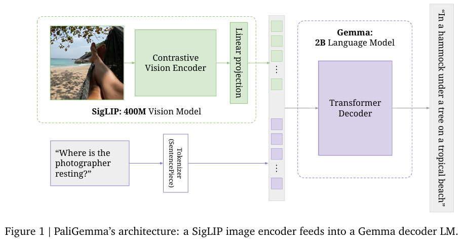

# PyTorch_paligemma-3b-pt-224_VLM
implementation of paligemma VLM that includes model architecture and inference code

<figure>
   
  <figcaption>source: https://arxiv.org/pdf/2407.07726</figcaption>
</figure>
